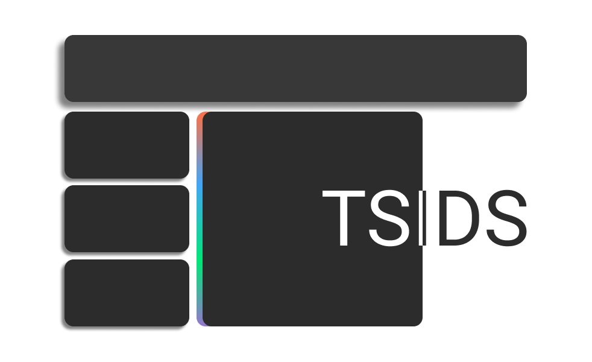

# TSIDS

  
  <h3 align="center">TSIDS</h3>
  

    Frontend: HTML + JS   Backend: NodeJS
     
    <a href="http://6p4ever.website:3001"><strong>Visit Now »</strong></a>
     
     
    <a href="https://github.com/MisterCommand/TSIDS/releases">Releases</a>
    ·
    <a href="https://github.com/MisterCommand/TSIDS/issues">Report Bug</a>
  

## What is TSIDS
TSIDS (Teacher and Student Information Display System) is a fully automatic classroom information display software. It currently contains a NodeJS backend script, a web page for display and control. It is currently deployed in a Docker container.

## Features
- Display current time
- Display current weather (temperature, rain, weather warnings, weather reminders)
- Display today and future homework
- Countdown to the end of the lesson
- Client-side timetable system
- Modular components (now, info, homework)
- Manage special events and marquee (Version 2 work in progress)

